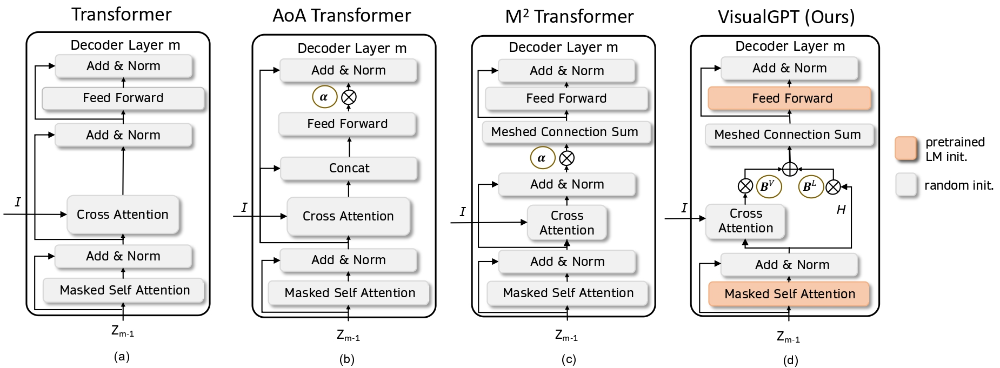

# VisualGPT

Our Paper [VisualGPT: Data-efficient Adaptation of Pretrained Language Models for Image Captioning](https://arxiv.org/abs/2102.10407)

## Main Architecture of Our VisualGPT



## Download the GPT-2 pretrained weights
```
curl --output gpt2-pytorch_model.bin https://s3.amazonaws.com/models.huggingface.co/bert/gpt2-pytorch_model.bin
```

## Enviroment setup
Clone the repository and create the `visualgpt` conda environmnet


```
conda env create -f environment.yml
conda activate visualgpt
```

Then download spacy data

```
python -m spacy download en
```

## Data preparation
We provide the COCO dataset for downloading. Please download the annotations file [annotations.zip](https://drive.google.com/file/d/1i8mqKFKhqvBr8kEp3DbIh9-9UNAfKGmE/view?usp=sharing) and extract it.
and [coco_detections.hdf5](https://drive.google.com/open?id=1MV6dSnqViQfyvgyHrmAT_lLpFbkzp3mx), in which the data is stored in a `<key, value>` where key is the image id and value is a tensor (N, 2048). N it the number of detections

## code structure


create the log folder ``mkdir logs`` and start the training

## Train the model
```
python train_visualGPT.py --batch_size 50 --head 12 --tau 0.2 --features_path coco_detections.hdf5 --annotation_folder annotations --lr 1e-4 --gpt_model_type gpt --random_seed 42 --log_file logs/log --exp_name experiment_log --lr 1e-4 --decoder_layer 12 --optimizer_type adamw  --gradient_accumulation_steps 2 --train_percentage 0.001 --split_train_data
```


## Acknowledgement
This code used resources from [Meshed Memory Transformer](https://github.com/aimagelab/meshed-memory-transformer) and [Transformers](https://github.com/huggingface/transformers)


Please cite our paper from the following bibtex

```
@inproceedings{chen2021visualgpt,
  title={VisualGPT: Data-efficient Image Captioning by Balancing Visual Input and Linguistic Knowledge from Pretraining},
  author={Chen, Jun and Guo, Han and Yi, Kai and Li, Boyang and Elhoseiny, Mohamed},
  booktitle={CVPR 2022},
  year={2022}
}


@article{chen2021visualgpt,
  title={VisualGPT: Data-efficient Image Captioning by Balancing Visual Input and Linguistic Knowledge from Pretraining},
  author={Chen, Jun and Guo, Han and Yi, Kai and Li, Boyang and Elhoseiny, Mohamed},
  journal={arXiv preprint arXiv:2102.10407},
  year={2021}
}

@article{chen2021visualgpt,
  title={VisualGPT: Data-efficient Adaptation of Pretrained Language Models for Image Captioning},
  author={Chen, Jun and Guo, Han and Yi, Kai and Li, Boyang and Elhoseiny, Mohamed},
  journal={arXiv preprint arXiv:2102.10407},
  year={2021}
}

```
